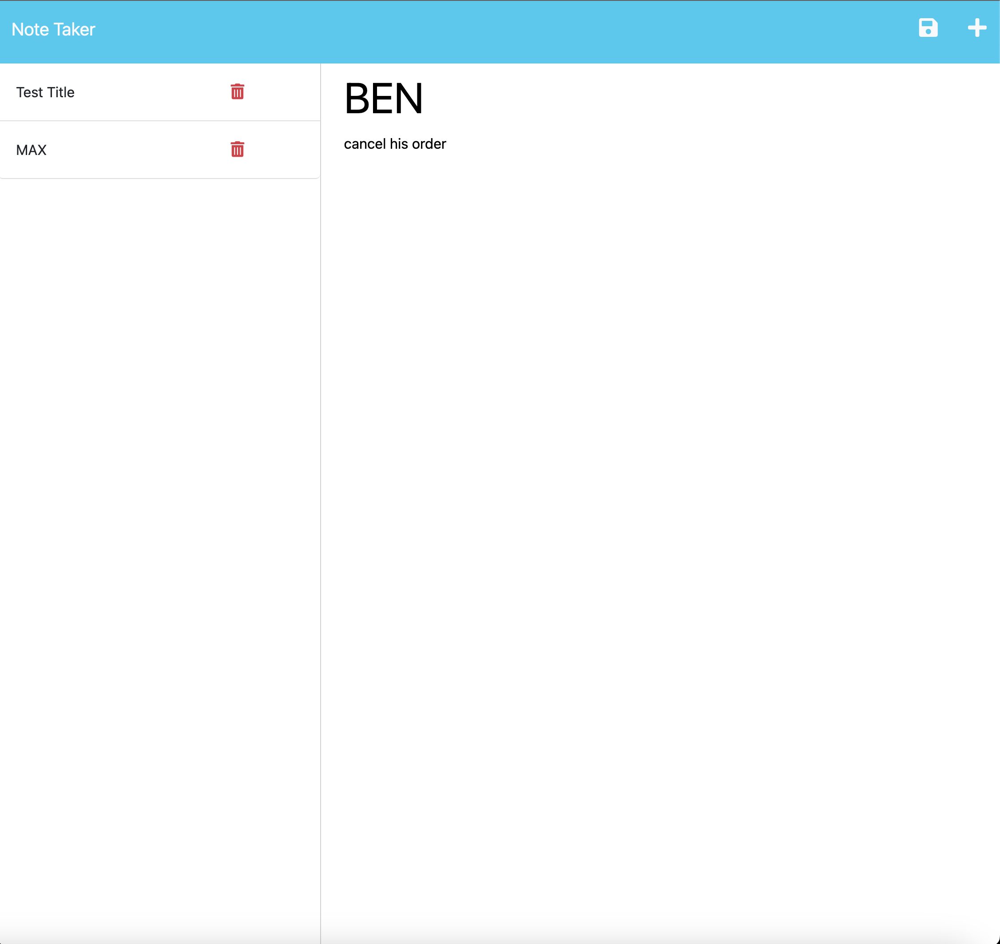

# Note Taker

## Description

This is a simple note-taking application that allows users to create, save, and view notes. The application provides a user-friendly interface to manage and organize your thoughts effectively.

## Installation

1. Clone the repository to your local machine.

2. Open the terminal and navigate to the project directory.

3. Install the required dependencies by running the following

command: npm i

## Usage

1. Open the Note Taker application.

2. The landing page will be displayed, showing a link to the notes page.

3. Click on the link to navigate to the notes page.

4. On the notes page, you will see the existing notes listed in the left-hand column.

5. The right-hand column will display empty fields to enter a new note title and the note's text.

6. Enter a new note title and the corresponding text in the provided fields.

7. After entering the note details, a Save icon will appear in the navigation at the top of the page.

8. Click on the Save icon to save the new note.

9. The new note will be saved and displayed in the left-hand column with the other existing notes.

10. To view an existing note, click on it from the list in the left-hand column.

11. The selected note will appear in the right-hand column for viewing.

12. If you want to create a new note without selecting an existing one, click on the Write icon in the navigation at the top of the page.

13. Empty fields to enter a new note title and the note's text will be presented in the right-hand column.

## license

MIT

## Credits

Columbia University Coding Bootcamp

https://github.com/coding-boot-camp/miniature-eureka

https://github.com/branchwag/notetakerapp
